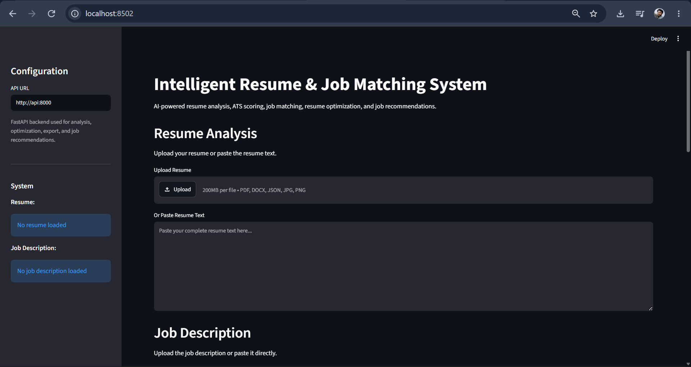
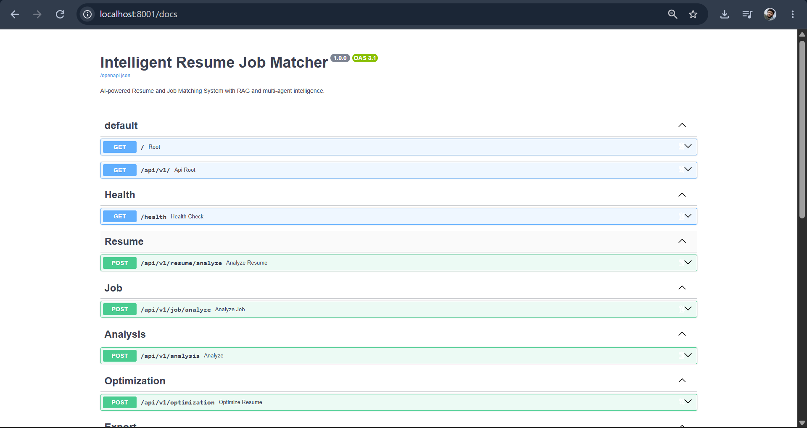

# Intelligent Resume & Job Matching System

<p align="center">
  
  
  
  
  
  
</p>

<p align="center">
  <b>AI-powered resume analysis, ATS evaluation, semantic job matching, evidence-grounded optimization, and multi-job recommendations.</b>
</p>

<p align="center">
  <a href="https://github.com/Vishnutpillai">GitHub</a> •
  <a href="https://www.linkedin.com/in/vishnu-t-pillai">LinkedIn</a>
</p>

---

## 📌 Overview

**Intelligent Resume & Job Matching System** is an end-to-end AI/ML application that analyzes a candidate's resume against a job description and produces an explainable compatibility assessment.

The system combines structured profile extraction, skill matching, semantic similarity, experience/project/education evaluation, ATS analysis, skill-gap detection, resume optimization, DOCX export, and multi-job ranking behind a FastAPI backend with a Streamlit user interface.

The project is designed as a production-oriented portfolio application rather than a single-model demo, with automated tests, API contracts, Docker support, SQLite persistence, and a modular service architecture.

> **Project status:** Core application completed and locally verified end-to-end. Full automated test suite: **155 passed**.

---

## 🎯 Problem Statement

Traditional resume screening can be time-consuming for both candidates and recruiters. Keyword-only matching can also miss semantic relationships between a candidate's experience and the requirements of a role.

This project addresses that gap by combining:

- Structured resume and job-description extraction
- Rule-based skill matching
- Semantic embedding similarity
- Experience, project, and education alignment
- ATS compatibility analysis
- Skill-gap identification
- Evidence-grounded resume optimization
- Optimization acceptance/rejection based on objective score comparison
- Ranking of multiple job descriptions
- API and dashboard interfaces

---

## ✨ Key Features

### 📄 Resume Ingestion

Supports multiple resume formats:

- PDF
- DOCX
- JSON
- JPG / JPEG
- PNG

For image-based resumes, OCR processing is supported through Tesseract.

### 🧾 Job Description Processing

Job descriptions can be:

- Uploaded as files
- Pasted directly into the Streamlit UI
- Processed individually through the FastAPI API

### 🧠 Resume & Job Extraction

Extracts structured information including:

- Candidate identity
- Summary
- Skills
- Education
- Experience
- Projects
- Certifications
- Required skills
- Preferred skills
- Minimum experience
- Keywords

### 🎯 Explainable Matching

The matching engine combines weighted components:

| Component | Weight |
|---|---:|
| Required Skills | 30% |
| Semantic Similarity | 25% |
| Experience | 15% |
| Projects | 10% |
| Education | 10% |
| Preferred Skills | 10% |

The result includes:

- Overall match score
- Component score breakdown
- Matched skills
- Missing skills
- Strengths
- Weaknesses
- Recommendations

### 🤖 Semantic Matching

Uses Sentence Transformers embeddings and cosine similarity to compare the meaning of resume content and job requirements rather than relying only on exact keyword overlap.

The semantic model is cached in-process to avoid repeatedly loading the embedding model for multiple comparisons.

### 📊 ATS Analysis

The ATS analyzer evaluates:

- Keyword coverage
- Resume sections
- Title relevance
- Project strength
- Quantifiable metrics
- Formatting considerations

It generates an overall ATS score and targeted recommendations.

### 🔍 Skill-Gap Analysis

Identifies:

- Required skills already covered
- Missing required skills
- Preferred skills
- Skill-alignment gaps

### ✍️ Resume Optimization

The optimization pipeline:

1. Calculates the initial match score
2. Runs ATS analysis
3. Runs skill-gap analysis
4. Generates an optimized resume
5. Rebuilds resume text
6. Recalculates the optimized score
7. Compares before vs. after
8. Accepts the optimization only when it does not reduce the overall score

This prevents an optimization step from silently making the resume less compatible with the target role.

### 📝 DOCX Export

The final resume can be exported as a `.docx` document through the FastAPI export API.

### 🏆 Multi-Job Recommendations

The recommendation engine can rank multiple job descriptions against a single resume.

Supports:

- Multiple uploaded JDs
- Multiple pasted JDs
- `---JOB---` separators for pasted job sets
- Match score ranking
- Score breakdown
- Matched skills
- Missing skills
- Strengths
- Weaknesses
- Recommendations

### 🚀 Dockerized Architecture

The application is structured as two services:

- FastAPI backend
- Streamlit frontend

Docker Compose provides local multi-container execution and service-to-service communication.

---

# 🏗️ System Architecture

## High-Level Architecture

```text
                        ┌─────────────────────────────┐
                        │          User                │
                        │ Resume + Job Description     │
                        └──────────────┬──────────────┘
                                       │
                                       ▼
                        ┌─────────────────────────────┐
                        │       Streamlit UI           │
                        │  Upload / Paste / Results    │
                        └──────────────┬──────────────┘
                                       │ HTTP
                                       ▼
                        ┌─────────────────────────────┐
                        │         FastAPI API          │
                        │   REST Endpoints / Services  │
                        └──────────────┬──────────────┘
                                       │
             ┌─────────────────────────┼─────────────────────────┐
             │                         │                         │
             ▼                         ▼                         ▼
     ┌────────────────┐      ┌──────────────────┐      ┌──────────────────┐
     │ Ingestion &    │      │ Matching &        │      │ Evaluation &     │
     │ Extraction     │      │ Semantic Scoring  │      │ Optimization     │
     └────────┬───────┘      └─────────┬────────┘      └─────────┬────────┘
              │                        │                         │
              ▼                        ▼                         ▼
        PDF/DOCX/JSON             Embeddings               ATS / Skill Gap
        OCR / Text                Cosine Similarity        Resume Optimizer
                                                               │
                                                               ▼
                                                    ┌──────────────────────┐
                                                    │ Final Resume / DOCX  │
                                                    │ Job Recommendations  │
                                                    └──────────────────────┘
```

### Architecture Image


---

# 🖥️ User Interface

The Streamlit interface provides an end-to-end workflow for:

1. Resume upload or paste
2. Job description upload or paste
3. Resume/job analysis
4. Match score visualization
5. ATS score visualization
6. Score breakdown
7. Skill gap analysis
8. Resume optimization
9. DOCX export
10. Multi-job recommendations

### UI Screenshot





# ⚡ FastAPI / Swagger API

The backend exposes the application's core capabilities through REST endpoints with automatically generated OpenAPI documentation.

### Swagger UI Screenshot




### Core Endpoints

| Method | Endpoint | Purpose |
|---|---|---|
| GET | `/health` | Service health check |
| POST | `/api/v1/resume/analyze` | Resume ingestion endpoint |
| POST | `/api/v1/job/analyze` | Job-description ingestion endpoint |
| POST | `/api/v1/analysis` | Resume-job analysis |
| POST | `/api/v1/optimization` | Resume optimization |
| POST | `/api/v1/export/docx` | DOCX resume export |
| POST | `/api/v1/recommendations` | Rank multiple jobs |

Open Swagger locally at:

```text
http://localhost:8001/docs
```

when using the Dockerized local configuration described below.

---

# 🔄 End-to-End Workflow

```text
Resume File / Text
       │
       ▼
Document Ingestion
       │
       ▼
Resume Extraction
       │
       ├──────────────► Structured ResumeProfile
       │
       ▼
Job Description
       │
       ▼
Job Extraction
       │
       ├──────────────► Structured JobProfile
       │
       ▼
Deterministic Matching
       │
       ├── Required Skills
       ├── Preferred Skills
       ├── Experience
       ├── Projects
       └── Education
       │
       ▼
Semantic Matching
       │
       ▼
Overall Match Score
       │
       ├──────────────► ATS Analysis
       ├──────────────► Skill Gap
       └──────────────► Recommendations
       │
       ▼
Resume Optimization
       │
       ├── Generate optimized resume
       ├── Recalculate match score
       ├── Compare scores
       └── Accept / Reject
       │
       ▼
Final Resume
       │
       ├──────────────► DOCX Export
       └──────────────► Job Recommendations
```

---

# 🛠️ Technology Stack

## Backend

- Python 3.11+
- FastAPI
- Uvicorn
- Pydantic
- SQLAlchemy
- SQLite

## NLP / Machine Learning

- Sentence Transformers
- Scikit-learn
- Transformers
- PyTorch
- Hugging Face ecosystem
- Rank BM25
- FAISS

## Resume / Document Processing

- PyPDF
- python-docx
- Pytesseract
- Tesseract OCR
- JSON parsing

## Frontend

- Streamlit

## Infrastructure

- Docker
- Docker Compose
- Git / GitHub

## Testing

- Pytest
- FastAPI TestClient
- Unit tests
- Integration tests

---

# 📁 Project Structure

```text
intelligent-resume-job-matcher/
│
├── app/
│   ├── api/
│   │   ├── analysis.py
│   │   ├── export.py
│   │   ├── health.py
│   │   ├── job.py
│   │   ├── optimization.py
│   │   ├── recommendations.py
│   │   └── resume.py
│   │
│   ├── core/
│   │   └── config.py
│   │
│   ├── schemas/
│   │   ├── api.py
│   │   ├── job.py
│   │   ├── matching.py
│   │   └── resume.py
│   │
│   ├── services/
│   │   ├── job_recommendation_service.py
│   │   └── resume_export_service.py
│   │
│   ├── main.py
│   └── frontend.py
│
├── database/
│   ├── connection.py
│   └── models.py
│
├── src/
│   ├── agents/
│   ├── embeddings/
│   ├── evaluation/
│   ├── extraction/
│   ├── ingestion/
│   ├── matching/
│   ├── optimization/
│   ├── parsing/
│   ├── rag/
│   ├── reranking/
│   └── retrieval/
│
├── data/
│   └── samples/
│
├── tests/
│   ├── integration/
│   └── unit/
│
├── Dockerfile
├── Dockerfile.streamlit
├── compose.yaml
├── .dockerignore
├── .env.example
├── requirements.txt
└── README.md
```

---

# 🚀 Local Setup

## 1. Clone the repository

```bash
git clone https://github.com/Vishnutpillai/intelligent-resume-job-matcher.git
cd intelligent-resume-job-matcher
```

## 2. Create / activate the Conda environment

```bash
conda create -n resume python=3.11
conda activate resume
```

## 3. Install dependencies

```bash
pip install -r requirements.txt
```

## 4. Configure environment variables

Create a `.env` file based on:

```text
.env.example
```

Example:

```env
APP_NAME=Intelligent Resume Job Matcher
APP_ENV=development
DEBUG=true

DATABASE_URL=sqlite:///./resume_matcher.db

VECTOR_DB=faiss
EMBEDDING_MODEL=sentence-transformers/all-MiniLM-L6-v2

LLM_PROVIDER=ollama
LLM_MODEL=qwen3:4b

LOG_LEVEL=INFO
```

> Never commit `.env` or credentials to GitHub.

---

# ▶️ Run Locally Without Docker

## Start FastAPI

```bash
uvicorn app.main:app --reload
```

API:

```text
http://127.0.0.1:8000
```

Swagger:

```text
http://127.0.0.1:8000/docs
```

## Start Streamlit

In another terminal:

```bash
python -m streamlit run app/frontend.py
```

UI:

```text
http://localhost:8501
```

---

# 🐳 Run With Docker Compose

Build the images:

```bash
docker compose build
```

Start the services:

```bash
docker compose up -d
```

Check containers:

```bash
docker compose ps
```

Expected services:

```text
resume-matcher-api
resume-matcher-frontend
```

Open:

### Streamlit

```text
http://localhost:8502
```

### FastAPI Swagger

```text
http://localhost:8001/docs
```

Stop:

```bash
docker compose down
```

View logs:

```bash
docker compose logs -f
```

---

# 🧪 Testing

Run the complete test suite:

```bash
pytest -q
```

Current project verification:

```text
155 passed
```

The test coverage includes:

- Matching engine
- Semantic matching
- Skill matching
- Experience matching
- Project matching
- Education matching
- ATS evaluation
- Resume optimization
- Job recommendations
- FastAPI endpoints
- DOCX export
- Phase 5 API integration

Before committing changes:

```bash
git diff --check
```

---

# 📊 Matching Methodology

The overall match score is calculated using a weighted scoring model:

```text
Overall Score =
    Required Skills × 0.30
  + Semantic Similarity × 0.25
  + Experience × 0.15
  + Projects × 0.10
  + Education × 0.10
  + Preferred Skills × 0.10
```

This gives exact skill coverage a significant influence while still allowing semantic similarity and broader profile alignment to contribute.

---

# 🧠 Semantic Similarity

The semantic matching component:

1. Loads the configured Sentence Transformer model.
2. Encodes resume and job-description text.
3. Normalizes embeddings.
4. Calculates cosine similarity.
5. Converts similarity into a 0–100 score.

The embedding model is cached so multiple job comparisons can reuse the same loaded model.

---

# ✍️ Optimization Acceptance Logic

The system does not blindly trust generated resume changes.

```text
Initial Resume
      │
      ▼
Initial Match Score
      │
      ▼
Generate Optimized Resume
      │
      ▼
Optimized Match Score
      │
      ├── Optimized >= Initial
      │        │
      │        ▼
      │     ACCEPT
      │
      └── Optimized < Initial
               │
               ▼
             REJECT
               │
               ▼
       Keep Original Resume
```

This makes the optimization pipeline score-aware and prevents a generated revision from automatically replacing a better-scoring resume.

---

# 🔌 API Example

## Analysis

```http
POST /api/v1/analysis
Content-Type: application/json
```

Example request:

```json
{
  "resume": {
    "candidate_id": "candidate_001",
    "name": "Test Candidate",
    "skills": ["Python", "SQL"]
  },
  "job": {
    "job_id": "job_001",
    "title": "Data Scientist",
    "required_skills": ["Python", "SQL"]
  },
  "resume_text": "Data Scientist Python SQL Machine Learning",
  "job_text": "Data Scientist Python SQL Machine Learning",
  "use_llm": false
}
```

---

# 🏆 Job Recommendation Example

Multiple jobs can be ranked against one resume.

```json
{
  "resume": {},
  "resume_text": "Data Scientist Python SQL Machine Learning",
  "jobs": [
    {},
    {}
  ],
  "job_texts": [
    "Data Scientist Python SQL Machine Learning",
    "Python Developer Python"
  ]
}
```

The API returns ranked recommendations containing:

- Rank
- Job title
- Company
- Overall score
- Score breakdown
- Matched skills
- Missing skills
- Strengths
- Weaknesses
- Recommendations

---

# 🔐 Configuration & Security

Recommended production practices:

- Keep `.env` outside Git.
- Do not commit API keys.
- Do not commit local SQLite database files.
- Keep secrets in deployment-platform environment variables.
- Validate uploaded documents before parsing.
- Restrict production CORS settings.
- Use HTTPS in public deployment.
- Use a managed PostgreSQL database for production persistence.

---

# ☁️ Deployment

The application is Dockerized for deployment as separate services.

```text
                    GitHub
                       │
             ┌─────────┴─────────┐
             │                   │
             ▼                   ▼
      FastAPI Service       Streamlit Service
      Dockerfile            Dockerfile.streamlit
             │                   │
             ▼                   │
       Public API URL ◄──────────┘
```

For a hosted environment, configure the Streamlit service with:

```env
API_URL=https://<your-fastapi-service-url>
```

The exact public deployment target can be Render, AWS, or another Docker-compatible platform.

> **Deployment note:** The local Docker setup is verified. Cloud hosting should be configured with an appropriate memory tier because the Sentence Transformers / PyTorch dependency stack can require substantially more RAM than lightweight web-only services.

---

# 📸 Screenshots & Project Showcase

Place project images in:

```text
docs/
└── images/
    ├── architecture.png
    ├── streamlit-ui.png
    ├── optimization-ui.png
    └── fastapi-swagger.png
```

## Architecture


## Streamlit Dashboard


## Resume Optimization


## FastAPI Swagger


> Add the actual screenshots/diagram renders to `docs/images/` so GitHub displays them automatically.

---

# 📈 Project Highlights

### Engineering

- Modular FastAPI backend
- Streamlit frontend
- Typed Pydantic schemas
- SQLAlchemy persistence
- Dockerized services
- SQLite local database
- Automated unit and integration testing

### AI / ML

- Sentence Transformer embeddings
- Semantic similarity
- Skill matching
- ATS scoring
- Skill-gap analysis
- Resume optimization
- Job recommendation ranking
- RAG / retrieval-oriented project structure
- Optional local LLM integration through Ollama

### Reliability

- 155 passing automated tests
- API validation
- Optimization acceptance gate
- Cached embedding model
- Error handling in frontend/backend
- DOCX export validation
- Integration testing for Phase 5 APIs

---

# 🗺️ Roadmap

## Completed

- [x] Project configuration
- [x] Resume ingestion
- [x] PDF / DOCX / JSON / image support
- [x] OCR support
- [x] Resume extraction
- [x] Job-description extraction
- [x] Skill matching
- [x] Semantic matching
- [x] Experience matching
- [x] Project matching
- [x] Education matching
- [x] ATS analysis
- [x] Skill-gap analysis
- [x] Resume optimization
- [x] Optimization acceptance gate
- [x] FastAPI backend
- [x] SQLite integration
- [x] Streamlit frontend
- [x] DOCX export
- [x] Job recommendations
- [x] Dockerization
- [x] 155 automated tests passing

## Future Improvements

- [ ] Production PostgreSQL
- [ ] Authentication and user accounts
- [ ] Persistent cloud object storage
- [ ] Background job processing
- [ ] CI/CD pipeline
- [ ] Production observability
- [ ] Better OCR quality evaluation
- [ ] More advanced reranking
- [ ] Model/version tracking
- [ ] Public hosted demo
- [ ] Resume history and comparison dashboard

---

# 👨‍💻 Author

## Vishnu T Pillai

**Data Scientist | Machine Learning Engineer | AI Enthusiast**

I build practical AI/ML systems focused on machine learning, NLP, computer vision, MLOps, deployment, and production-oriented application development.

### Profiles

- GitHub: [Vishnutpillai](https://github.com/Vishnutpillai)
- LinkedIn: [Vishnu T Pillai](https://www.linkedin.com/in/vishnu-t-pillai)

---

# 🤝 Contributing

Contributions, issues, and improvement suggestions are welcome.

A typical workflow:

```bash
git clone https://github.com/Vishnutpillai/intelligent-resume-job-matcher.git
cd intelligent-resume-job-matcher

git checkout -b feature/your-feature

# make changes

pytest -q
git diff --check

git add .
git commit -m "Add your feature"
git push origin feature/your-feature
```

Then open a pull request.

---

# 📜 License

Add the project's chosen license in a separate `LICENSE` file before publishing it as an open-source project.

---

# ⭐ Why This Project Matters

This project demonstrates more than a resume-matching model.

It brings together:

**Document AI + NLP + Embeddings + Explainable Matching + ATS Evaluation + Optimization + REST APIs + Frontend Engineering + Testing + Docker**

into one end-to-end application.

The goal is to move from:

> **"Can I build an ML model?"**

to:

> **"Can I build, test, package, expose, and operate an AI-powered application?"**

---

<p align="center">
  <b>Built with Python • FastAPI • Streamlit • Sentence Transformers • Scikit-learn • Docker</b>
</p>

<p align="center">
  <a href="https://github.com/Vishnutpillai">GitHub</a> •
  <a href="https://www.linkedin.com/in/vishnu-t-pillai">LinkedIn</a>
</p>
